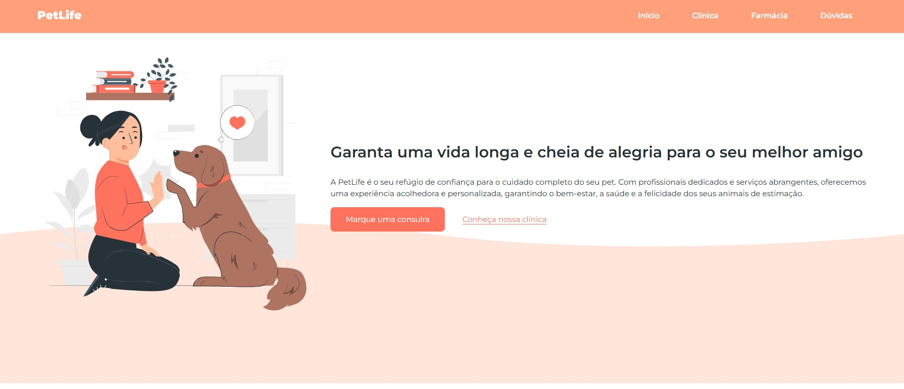

<h1 align="center"><strong>PetLife</strong></h1>

  

## 🚀 Tecnologias

Esse projeto foi desenvolvido com as seguintes tecnologias:

-   

- 

- 
   

- 

## 💻 Projeto

O projeto é uma página de um petshop online, chamada PetLife, dedicada ao cuidado e bem-estar de animais de estimação.

- Acesse o projeto finalizado, [online](https://brunotxrs.github.io/petlife/)

## 🔖 Layout

Você pode visualizar o layout do projeto através [DESSE LINK](https://www.figma.com/design/ObmGmIUdpg2L4HbgggwcIy/Funil-OBC-Start-2.0). É necessário ter conta no [Figma](https://figma.com) para acessá-lo.

---

Developed by Bruno Teixeira :wave: [siga!](https://www.instagram.com/bruno_txrs/)
