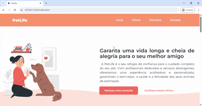

## PetLife - Projeto Front-End
Bem-vindo ao repositório do projeto <strong>PetLife</strong>! Este projeto foi desenvolvido como uma aplicação prática das minhas habilidades como desenvolvedor Front-End, com foco em criar uma experiência responsiva e acessível para os usuários. O site foi estilizado utilizando a abordagem Mobile-First, garantindo que a experiência em dispositivos móveis seja priorizada, e posteriormente ajustada para telas maiores através de Media Queries.


## 📌 Visão Geral
O PetLife é um site fictício de uma clínica veterinária que oferece serviços de saúde, bem-estar e produtos para animais de estimação. O objetivo do projeto foi criar uma interface intuitiva e responsiva, que proporcionasse uma navegação fluida tanto em dispositivos móveis quanto em desktops.

O site foi desenvolvido utilizando **HTML**, **CSS** e **JavaScript**, com uma estrutura modularizada para facilitar a manutenção e escalabilidade do código.


## 🛠️ Tecnologias Utilizadas

 → Estruturação do conteúdo da página.

 → Estilização do site, com foco em Mobile-First e Media Queries para responsividade.

 → Interatividade no site, como a funcionalidade de expandir e recolher as dúvidas frequentes.

 → Utilização da fonte Montserrat para garantir uma tipografia moderna e legível.

 → Para visualizar o layout do projeto.

Você pode visualizar o layout do projeto, [Clicando aqui](https://www.figma.com/design/ObmGmIUdpg2L4HbgggwcIy/Funil-OBC-Start-2.0). É necessário ter conta no [Figma](https://figma.com) para acessá-lo.

SVG: Uso de imagens vetoriais para garantir qualidade e performance em diferentes resoluções.


## 📂 Estrutura do Projeto
O projeto está organizado da seguinte forma:

```bash

PetLife/
├── src/
│   ├── assets/         # Pasta contendo imagens e ícones
│   ├── js/             # Pasta contendo o arquivo JavaScript
│   └── styles/         # Pasta contendo os arquivos CSS
│       ├── global.css  # Estilos globais e variáveis CSS
│       ├── header.css  # Estilos específicos para o cabeçalho
│       ├── main.css    # Estilos específicos para o conteúdo principal
│       ├── footer.css  # Estilos específicos para o rodapé
│       └── style.css   # Arquivo principal que importa todos os outros estilos
├── index.html          # Página principal do site
├── License             # MIT License
└── README.md           # Documentação do projeto

```

## 🎨 Design e Responsividade
O design do site foi pensado para ser minimalista e amigável, com cores suaves e elementos visuais que transmitem confiança e cuidado. A abordagem Mobile-First garantiu que o site fosse otimizado para dispositivos móveis, com um layout que se adapta perfeitamente a telas maiores através de Media Queries.

**Principais Características de Design:**
- **Cores:** Utilização de uma paleta de cores suaves, com destaque para tons de laranja e branco, que transmitem calor e confiança.

- **Tipografia:** A fonte Montserrat foi escolhida por sua legibilidade e modernidade.

- **Imagens:** Uso de ilustrações em SVG para garantir que as imagens sejam leves e escaláveis.

**Responsividade:**
- **Mobile:** O layout foi projetado para ser compacto e fácil de navegar em telas pequenas, com botões e links bem espaçados para facilitar o toque.

- **Desktop:** Em telas maiores, o layout se expande, aproveitando o espaço adicional para exibir mais conteúdo de forma organizada.


## 🚀 Funcionalidades
**1. Navegação Responsiva**
- O cabeçalho e o rodapé são totalmente responsivos, com links que facilitam a navegação entre as seções do site.

- O menu de navegação se adapta a diferentes tamanhos de tela, garantindo uma experiência consistente.

**2. Seção de Dúvidas Frequentes**
- Utilizando JavaScript, foi implementada uma funcionalidade que permite ao usuário expandir e recolher as respostas das dúvidas frequentes.

- Essa interação melhora a experiência do usuário, especialmente em dispositivos móveis, onde o espaço é limitado.

**3. Botões de Ação**
- Botões claros e chamativos para ações como "Marcar uma consulta" e "Conheça nossa clínica".

- Os botões são estilizados para serem facilmente identificáveis e responsivos ao toque.

**4. Rodapé com Informações de Contato**
- O rodapé contém links rápidos, informações de contato e um crédito ao desenvolvedor.

- Os links são estilizados para serem interativos, com sublinhado ao passar o mouse.

## 📝 Desafios e Aprendizados
Este projeto foi uma excelente oportunidade para colocar em prática conceitos importantes de desenvolvimento Front-End, como:

- **Mobile-First:** Aprendi a priorizar o design para dispositivos móveis e depois ajustar para telas maiores, garantindo uma experiência consistente em todos os dispositivos.

- **Media Queries:** Utilizei Media Queries para ajustar o layout e o design em diferentes tamanhos de tela, desde smartphones até desktops.

- **JavaScript Básico:** Implementei interações simples com JavaScript, como a expansão de seções de dúvidas frequentes.

- **Organização de Código:** A estrutura modularizada do CSS (com arquivos separados para header, main, footer, etc.) facilitou a manutenção e a escalabilidade do projeto.


## 📸 Capturas de Tela
Aqui estão algumas capturas de tela do projeto em diferentes dispositivos:

<p align="center"><strong>Mobile</strong></p>
<p align="center">
  
</p>

<p align="center"><strong>Desktop</strong></p>
<p align="center">
  
</p>


## 🙌 Créditos
Este projeto foi desenvolvido por <strong>Bruno Teixeira</strong> como parte do meu portfólio de desenvolvimento Front-End. Sinta-se à vontade para entrar em contato ou contribuir com o projeto!

- [](https://www.linkedin.com/in/brunotxrs/)

- [](https://github.com/brunotxrs)
